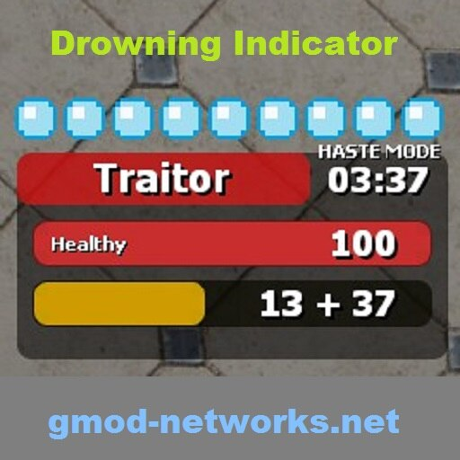

<div align="center">

# TTT Drowning Indicator



</div>


This addon displays a small HUD which shows how long one can stay underwater. It has been written for the TTT gamemode in Garry's Mod, but it should be adaptable to other gamemodes as well.

## Steampage
https://steamcommunity.com/sharedfiles/filedetails/?id=481440358

## Building the addon
You need to have Garry's Mod installed. Clone this repo, `cd` into it and run following command:

```sh
~/.steam/steamapps/common/GarrysMod/bin/gmad_linux create -folder . -out "drowning_indicator.gma"
```

## Releasing an update
Build the addon as above and then run:

```sh
LD_LIBRARY_PATH=~/.steam/steam/steamapps/common/GarrysMod/bin/ ~/.steam/steam/steamapps/common/GarrysMod/bin/gmpublish_linux update -addon drowning_indicator.gma -id "481440358" -changes "General fixes and system stability improvements"
```

You might not need to set `LD_LIBRARY_PATH`, however currently [this issue](https://github.com/Facepunch/garrysmod-issues/issues/4542) still persists.